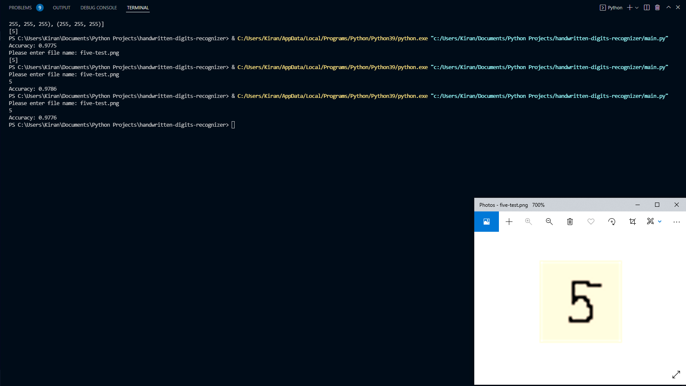

# handwritten-digits-recognizer
> Recognizes the digit in an image of a handwritten digit.

## Table of Contents
* [General Info](#general-information)
* [Technologies Used](#technologies-used)
* [Screenshots](#screenshots)
* [Setup](#setup)
* [Usage](#usage)
* [Project Status](#project-status)
* [Acknowledgements](#acknowledgements)
* [Contact](#contact)

## General Information
This program utilizes machine learning to determine which digit is present in an 28x28 pixel image file that contains a handwritten digit.

## Technologies Used
- Python 3
- sklearn
- PIL
- tkinter

## Screenshots

## Setup
Ensure sklearn, PIL, and tkinter have been installed.

## Usage
When run, the program will prompt the user to draw a digit within the box of the opened window. Once done, the user must press Control + s and the program will return the model's prediction as well as the accuracy percentage of the model. 

## Project Status
Project is: _complete_.

## Acknowledgements
Give credit here.
- This project was adapted from [this tutorial](https://www.youtube.com/watch?v=pqNCD_5r0IU&list=WL&index=42).

## Contact
Created by [@KiranSmelser](https://github.com/KiranSmelser) - please feel free to reach out and contact me!